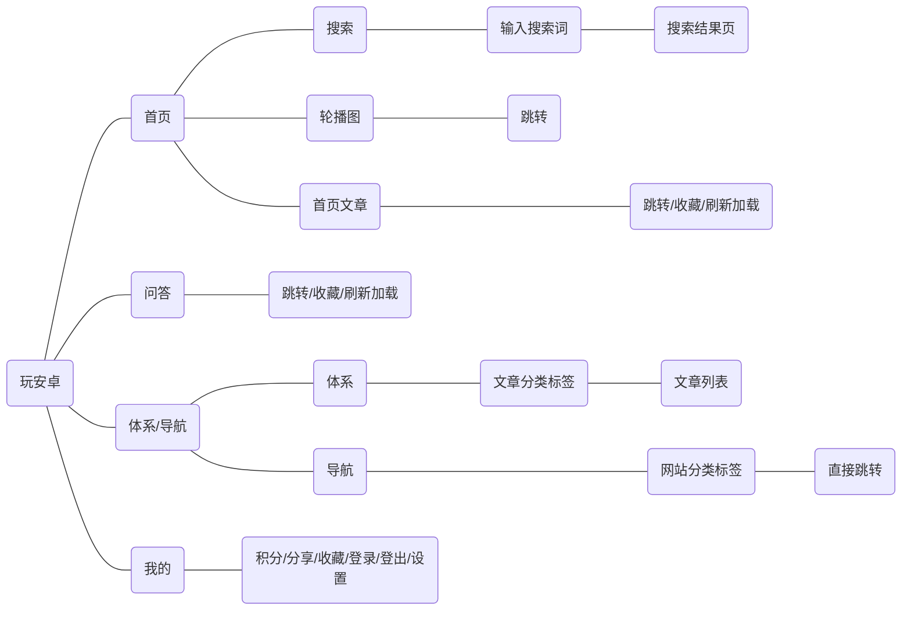

# WanAndroid

## 项目简介

这是一款用来浏览和发布安卓学习文章的APP，支持浏览、搜索、分享、收藏等操作。

我做的工作是将玩安卓网站改写成手机应用，原网站指路：https://wanandroid.com/。

### 导航页展示

			

## 系统设计

### WBS任务分解

设计版，项目初期设计的功能模块。


### 系统结构图

总结版，项目结束时编写，含所有页面和跳转逻辑。



### 原型图

又丑又少，意思一下。

	

## 系统实现

### 文章列表

整体：RecyclerView列表视图、RefreshLayout刷新加载视图。

子项：TextView文字视图、drawable绘制分类徽章的背景图、ShineButton收藏按钮（第三方组件）。

> ShineButton依赖：`implementation 'com.sackcentury:shinebutton:1.0.0'`

### 项目列表

比文章列表多了图片，来自网络，编写一个新的子项视图xml，用Glide加载图片。

```java
Glide.with(holder.preImage)
    .load(data.getEnvelopePic())
    .into(holder.preImage);
```

> Glide依赖：`implementation 'com.github.bumptech.glide:glide:4.11.0'`

### 首页轮播图

1、在模块的 build.gradle中 导入依赖：

`implementation 'com.github.zhpanvip:BannerViewPager:3.2.0'`

2、前端布局

3、编写三个类：

1. 轮播图数据实体类：BannerData
2. 轮播图视图子项：BannerViewHolder（继承 BaseViewHolder\<BannerData>）
3. 轮播图的适配器：BannerAdapter（继承 BaseBannerAdapter<BannerData,BannerViewHolder>）

### 底部导航栏

1、在res的menu文件夹下新建menu资源文件，添加四个menu item：首页、问答、体系、我的

2、在首页布局文件xml中，添加Material的BottomNavigationView组件，关联menu资源文件

​	`app:menu="@menu/bottom_navigation_menu"`

3、使用ViewPager+Fragment新增四个导航页，并与底部导航栏关联

```java
bottomNavigationView.setOnNavigationItemSelectedListener(...);
viewPager.addOnPageChangeListener(...);
```

### 自定义View

1、首页原形按钮组 CircleView

​	CIrcleView具有阴影和点击态，没有关联的布局文件，采用最原始的画笔绘制方式，效果如图：


2、带取消按钮的搜索框 EditTextPlus

​	有关联的xml，由 EditText 和 ImageView 组成，可以监听用户输入以及删除用户输入，效果如图：


### 登录和登出

1、封装类

​	登录登出状态、用户名、密码和头像都属于文件操作，封装成一个静态类FileUitl，方便外部类调用。

2、调用本地相册选头像

3、头像存储

​	头像复制到app的内部或外部存储空间，因为下次打开app如果是登录装态还要显示头像

```java
/**
 * 文件复制方法
 * @param uri 文件的uri标识
 * @param storageType 存储位置指定内部或外部
 * @param fileName 文件名
 * @throws IOException
 */
public static void fileCopy(Uri uri, int storageType, String fileName) throws IOException {
    //打开输入流
    InputStream inputStream = MyApplication.context.getContentResolver().openInputStream(uri);
    //指定存储位置
    File file;
    if(storageType==EXTERNAL_STORAGE){
        file = new File(MyApplication.context.getExternalFilesDir(null),fileName);
    }else{
        file = new File(MyApplication.context.getFilesDir(),fileName);
    }
    //打开输出流
    OutputStream outputStream = new FileOutputStream(file);

    //文件复制
    byte[] bytes = new byte[1024*30];
    int length;
    while((length=inputStream.read(bytes))!=-1){
        outputStream.write(bytes,0,length);
    }

    //关闭输入输出流
    inputStream.close();
    outputStream.close();
}
```

4、广播

​	登录登出会改变红心状态，用本地广播通知其他页面登录登出事件发生。

 1. 接收广播

    ```java
    /**
     * 在需要接收广播的类中定义登录登出的 广播接收器 和 过滤器
     */
    private BroadcastReceiver loginStateReceiver = new BroadcastReceiver() {
        @Override
        public void onReceive(Context context, Intent intent) {
            //登录
            if(intent.getBooleanExtra(LoginFragment.LOGIN_STATE,false)){...}
            else{//登出...}
        }
    };
    /**
     * 过滤器
     */
    private IntentFilter loginStateFilter = new IntentFilter(LoginFragment.LOGIN_ACTION);
    
    //在onCreateView方法中注册广播
    LocalBroadcastManager.getInstance(getContext()).registerReceiver(loginStateReceiver,loginStateFilter);
    //在onDestroy方法中取消注册
    LocalBroadcastManager.getInstance(getContext()).unregisterReceiver(loginStateReceiver);
    ```

 2. 发送广播

    ```java
    //发送登录成功的广播
    Intent loginIntent = new Intent(LOGIN_ACTION);                           loginIntent.putExtra(LOGIN_STATE,true);
    localBroadcastManager.sendBroadcast(loginIntent);
    //发送该退出登录的广播
    Intent(LoginFragment.LOGIN_ACTION);
    loginIntent.putExtra(LoginFragment.LOGIN_STATE,false);
    localBroadcastManager.sendBroadcast(loginIntent);
    ```

    

### Chip和Tab（标签）

1、体系页用了ChipGroup，小Chip在代码中动态添加

2、点击Chip后跳转到分类文章页，这一页有TabLayout，小Tab也是动态添加

​	用TabLayout+ViewPager，ViewPager里新建Fragment来实现分类文章浏览，如图：


### 网络请求

按页面封装了网络请求方法，分离了网络请求代码和操作视图的代码。

OkHttpClient+Request+(RequestBody)

client.newCall(request).enqueue(new Callback(){...})，enqueue表示异步请求

网络请求示例代码：

```java
/**
 * 新建okHttp客户端
 */
private OkHttpClient client = new OkHttpClient();

/**
 * 网络请求获取首页文章列表
 * @param phone
 * @param pageId
 */
public void getArticleData(final OneParamPhone<List<ArticleData>> phone,int pageId){
    Request request = new Request.Builder()
        .url(NetUtil.baseUrl+"/article/list/"+pageId+"/json")
        .get()
        .build();
    client.newCall(request).enqueue(new Callback() {
        @Override
        public void onFailure(@NotNull Call call, @NotNull IOException e) {

        }

        @Override
        public void onResponse(@NotNull Call call, @NotNull Response response) throws IOException {
            String jsonData = response.body().string();
            try {
                JSONArray data = new JSONObject(jsonData).getJSONObject("data").getJSONArray("datas");
                List<ArticleData> list = new Gson().fromJson(data.toString(),new TypeToken<List<ArticleData>>(){}.getType());
                if(phone!=null){
                    phone.onPhone(list);
                }
            } catch (JSONException e) {
                e.printStackTrace();
            }
        }
    });
}
```

## 反思

### 难点

#### 红心按钮

问题描述：

1. 网络请求返回文章数据时，没有收藏状态。所以文章列表和红心状态是两个网络请求，存在请求不同步的问题。
2. 没登录不能直接点收藏，退出登录后文章列表的收藏状态需要全部清空。
3. 很多页共用收藏文章集合这个数据，最好做缓存减少网络请求次数。

解决办法：

1. 把红心操作以及红心集合的缓存封装在一个工具类 FavoriteUtil

2. 用双重检验锁的方式保证红心集合的请求只发一次

   ```
   if无缓存：（一重）
   	lock加锁；（主线程）
   	if没缓存：（双重）
   		发送网络请求requestFavoriteSet，
   			把返回结果存入缓存；
   			标记为“已缓存”；
   			unlock释放锁；（网络请求线程）
   else有缓存：
   	从缓存中取数据；
   ```

   > 分别在两个线程lock和unlock行不通，这里用Handler来释放锁。
   >
   > ```java
   > //切换线程，释放锁
   > private static Handler handler = new Handler(Looper.myLooper()){
   >     @Override
   >     public void handleMessage(@NonNull Message msg) {
   >         aLock.unlock();
   >     }
   > };
   > ```

#### 图片缓存

IO读写不熟，多写几遍。示例代码在上面“系统实现”的“登录和登出”的“头像缓存”处。

### 收获

1. 对Android Studio的使用和安卓项目目录结构比较熟悉
2. 用到了多种组件：安卓自带组件、第三方开发的组件、自定义视图组件、Material组件
3. 熟练使用RecyclerView列表视图、okhttp3发送网络请求以及回调
4. 有debug经验，红心bug频出，改了很多天
5. 编码更规范了，逻辑层和视图层代码分离，重复代码和工具性的代码抽象成类，还有很多注释
6. 平心静气
7. 安卓开发从0到1

### 不足

1. UI美化
2. 网络请求等待提示
3. 我的-设置页
4. 首页文章列表没做磁盘缓存

### 说明

1. 感谢玩安卓网站提供的安卓学习资料，本项目所使用的后端接口均来自：[玩Android 开放API](https://wanandroid.com/blog/show/2)。

2. 下载GitHub项目首页的app-debug.apk到手机上就可以使用本APP。

   

